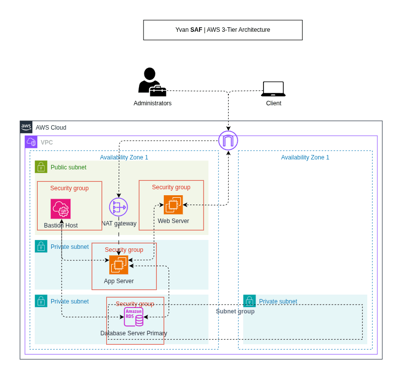

# AWS 3-Tier Architecture with Security-by-Design

**Yvan SAF** | AWS Certified Solutions Architect Associate | Cloud Security

This project deploys a 3-tier web application infrastructure on AWS. I built it to demonstrate how to apply security controls at every layer of an architecture, not just at the perimeter.

The three tiers are isolated from each other at the network level. Each one can only communicate with the tier directly adjacent to it, using the minimum set of ports required. The database has no internet access at all.

---

## Architecture



```
Internet
    |
    v
[Internet Gateway]
    |
    v
Public Subnet (10.0.1.0/24, AZ us-east-1a)
    |-- Bastion Host (SSM access only, no open ports)
    |-- Web Server  (Apache/PHP, ports 80 and 443)
    |
    v  port 8080 only
Private Subnet (10.0.2.0/24, AZ us-east-1a)
    |-- App Server (MariaDB client, SSM access only)
    |
    v  port 3306 only
Private Subnet (10.0.3.0/24 + 10.0.4.0/24, AZ us-east-1a and us-east-1b)
    |-- RDS MariaDB (encrypted, no public access, no internet route)
```

---

## Security Controls

| Layer | Control | What it does |
|-------|---------|--------------|
| Network | VPC with 4 subnets | Separates each tier into its own network segment |
| Network | Security Groups (SG to SG rules) | Only allows the exact ports between adjacent tiers |
| Network | Network ACLs | Second, independent layer of subnet-level filtering |
| Network | Route tables | Database subnet has no internet route at all |
| Network | VPC Flow Logs | Captures all accepted and rejected traffic (full-permission account) |
| Access | SSM Session Manager | No SSH, no open port 22, full session audit trail |
| Access | IMDSv2 enforced | Prevents SSRF attacks against the metadata endpoint |
| Data | EBS encryption | All instance root volumes encrypted at rest |
| Data | RDS encryption | Database storage encrypted using AWS-managed KMS key |
| Secrets | AWS Secrets Manager | RDS password never written in code or committed to Git |

---

## Repository Structure

```
aws-3tier-architecture/
├── infra/
│   ├── terraform/       Terraform code for automated deployment
│   └── console/         Step-by-step console guide with screenshots
├── docs/
│   ├── architecture/    Architecture diagram and console screenshots
│   ├── decisions/       Architecture Decision Records (ADR-001 to ADR-010)
│   └── lessons-learned.md
└── README.md
```

---

## Deploying with Terraform

### Prerequisites

- Terraform >= 1.5.0
- AWS CLI configured with valid credentials
- SSM Plugin for AWS CLI ([installation guide](https://docs.aws.amazon.com/systems-manager/latest/userguide/session-manager-working-with-install-plugin.html))

### 1. Set your AWS credentials

```bash
export AWS_ACCESS_KEY_ID="..."
export AWS_SECRET_ACCESS_KEY="..."
export AWS_SESSION_TOKEN="..."    # required if using temporary credentials
export AWS_DEFAULT_REGION="us-east-1"
```

### 2. Clone the repo and initialize Terraform

```bash
git clone https://github.com/yvansaf/aws-3tier-architecture.git
cd aws-3tier-architecture/infra/terraform
terraform init
```

### 3. Create your variables file

The `terraform.tfvars` file is excluded from Git. Create it from the defaults in `variables.tf`:

```bash
cat > terraform.tfvars << 'TFVARS'
aws_region   = "us-east-1"
project_name = "yvan-3tier"
environment  = "dev"
owner        = "yvan-raffi"

vpc_cidr                 = "10.0.0.0/16"
public_subnet_cidr       = "10.0.1.0/24"
private_subnet_app_cidr  = "10.0.2.0/24"
private_subnet_db_a_cidr = "10.0.3.0/24"
private_subnet_db_b_cidr = "10.0.4.0/24"
az_a                     = "us-east-1a"
az_b                     = "us-east-1b"

instance_type        = "t2.micro"
ami_id               = "ami-0c02fb55956c7d316"
lab_instance_profile = "LabInstanceProfile"

db_name              = "mydb"
db_username          = "admin"
db_instance_class    = "db.t3.micro"
db_allocated_storage = 20

alert_email = ""

enable_secrets_manager = false
enable_flow_logs       = false
TFVARS
```

### 4. Deploy

```bash
terraform plan
terraform apply
```

Deployment takes around 12 to 15 minutes. RDS is the slowest resource to provision.

### 5. Test the deployment

The outputs printed after `terraform apply` give you all the commands you need:

```bash
# Check that the web server is responding
curl http://<web_server_public_ip>/health.html

# Connect to the Bastion Host (no SSH key needed)
aws ssm start-session --target <bastion_instance_id> --region us-east-1

# Connect to the App Server
aws ssm start-session --target <app_instance_id> --region us-east-1

# Get the RDS password
terraform output -raw db_password
```

### 6. Clean up

```bash
terraform destroy
```

The NAT Gateway is the most expensive resource (~$0.045 per hour). Always destroy after finishing a session.

---

## Feature Flags

Two features are disabled by default because they require IAM permissions that may not be available in all environments. Both are fully implemented in the code and ready to enable.

| Flag | Default | What it enables | Permission required |
|------|---------|-----------------|---------------------|
| `enable_secrets_manager` | false | Store the RDS password in AWS Secrets Manager | `secretsmanager:CreateSecret` |
| `enable_flow_logs` | false | Send VPC network logs to CloudWatch | `iam:PassRole` |

To enable either feature, set the corresponding flag to `true` in your `terraform.tfvars` file.

---

## Console Deployment

A full step-by-step guide for deploying the same architecture through the AWS Management Console is available in [`infra/console/console-guide.md`](infra/console/console-guide.md). It includes screenshots at each key step.

---

## Architecture Decisions

The `docs/decisions/` folder contains 10 Architecture Decision Records explaining the reasoning behind every significant choice in this project.

| ADR | Decision |
|-----|----------|
| [ADR-001](docs/decisions/ADR-001-network-architecture.md) | Four-subnet layout across two AZs |
| [ADR-002](docs/decisions/ADR-002-database-network-isolation.md) | Complete network isolation for the database tier |
| [ADR-003](docs/decisions/ADR-003-ssm-session-manager.md) | SSM Session Manager instead of SSH |
| [ADR-004](docs/decisions/ADR-004-secrets-and-encryption.md) | Secret management and encryption strategy |
| [ADR-005](docs/decisions/ADR-005-nacls-as-second-defense-layer.md) | NACLs as a second layer of network defense |
| [ADR-006](docs/decisions/ADR-006-vpc-flow-logs.md) | VPC Flow Logs for network traffic auditing |
| [ADR-007](docs/decisions/ADR-007-imdsv2-enforcement.md) | IMDSv2 enforcement on all EC2 instances |
| [ADR-008](docs/decisions/ADR-008-terraform-code-organization.md) | Terraform code organization and environment constraints |
| [ADR-009](docs/decisions/ADR-009-rds-backup-availability.md) | RDS backup and availability strategy |
| [ADR-010](docs/decisions/ADR-010-monitoring-alerting.md) | Monitoring and alerting strategy |

---

## Lessons Learned

Six real problems I ran into while building and testing this project, and what I learned from each one.

See [`docs/lessons-learned.md`](docs/lessons-learned.md).

---

## Validation Results

| Test | Expected | Result |
|------|----------|--------|
| Web Server responds on port 80 | HTTP 200 from curl | Passed |
| Bastion accessible via SSM, no SSH | Session opens without key pair | Passed |
| App Server accessible via SSM only | Session opens, no public IP | Passed |
| App Server connects to RDS | mysql prompt appears | Passed |
| Bastion cannot reach RDS port 3306 | Connection timed out | Passed |
| IMDSv2 rejects requests without token | Empty response on plain GET | Passed |
| IMDSv2 works correctly with token | Instance ID returned | Passed |

---

## Author

Yvan SAF
AWS Certified Solutions Architect Associate | Cloud Security | DevSecOps
