# Console Deployment Guide

This guide walks through deploying the same 3-tier architecture using the AWS Management Console, step by step.

All screenshots referenced below go in `docs/architecture/screenshots/`. The full list of file names is in [`docs/architecture/screenshots/README.md`](../../docs/architecture/screenshots/README.md).

---

## Part 1: VPC and Networking

### Step 1 — Create the VPC

1. Go to **VPC** in the AWS Console
2. Click **Create VPC**
3. Select **VPC only** (not "VPC and more")
4. Fill in:
   - Name: `yvan-3tier-dev-vpc`
   - IPv4 CIDR: `10.0.0.0/16`
   - Tenancy: Default
5. Click **Create VPC**

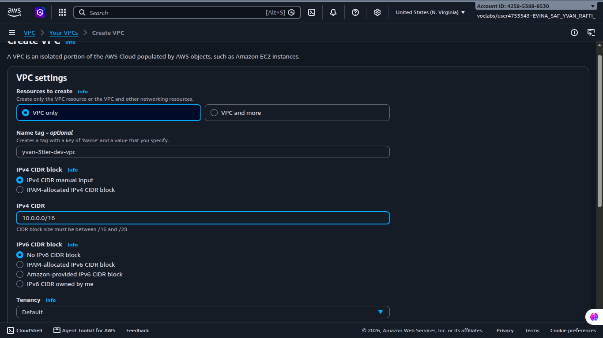

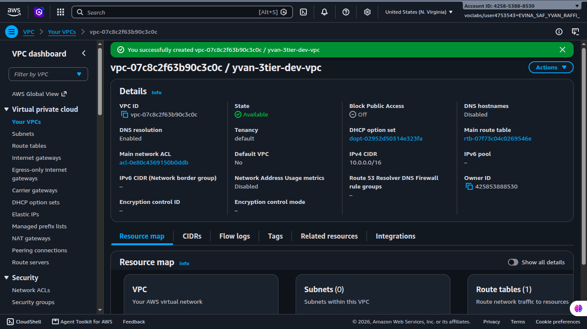

---

### Step 2 — Create the Four Subnets

Create each subnet one at a time. Go to **Subnets** then **Create subnet**, select your VPC, and fill in the details below.

| Name | AZ | CIDR | Type |
|------|----|------|------|
| `yvan-3tier-dev-public-subnet` | us-east-1a | 10.0.1.0/24 | Public |
| `yvan-3tier-dev-private-app-subnet` | us-east-1a | 10.0.2.0/24 | Private |
| `yvan-3tier-dev-private-db-subnet-a` | us-east-1a | 10.0.3.0/24 | Private |
| `yvan-3tier-dev-private-db-subnet-b` | us-east-1b | 10.0.4.0/24 | Private |

After creating the public subnet, select it, click **Actions**, then **Edit subnet settings**, and enable **Auto-assign public IPv4 address**.

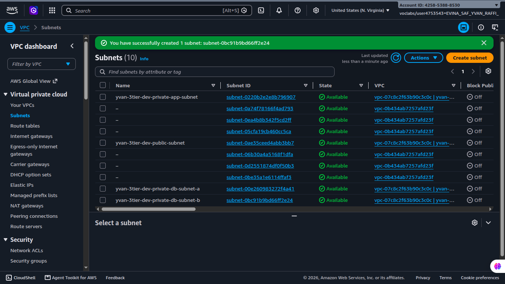

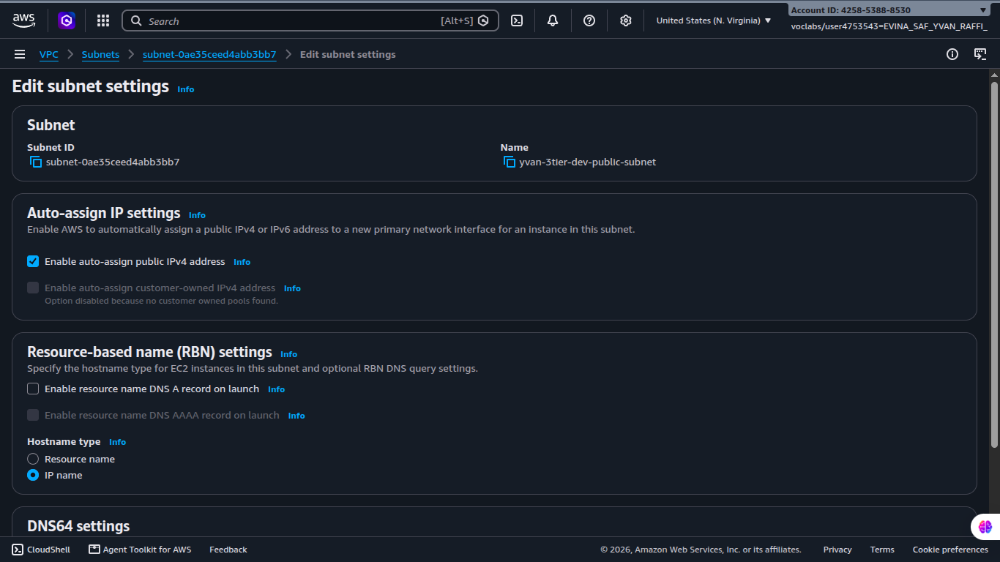

---

### Step 3 — Create the Internet Gateway

1. Go to **Internet gateways** then **Create internet gateway**
2. Name: `yvan-3tier-dev-igw`
3. After creation, click **Actions** then **Attach to VPC**
4. Select `yvan-3tier-dev-vpc` and attach

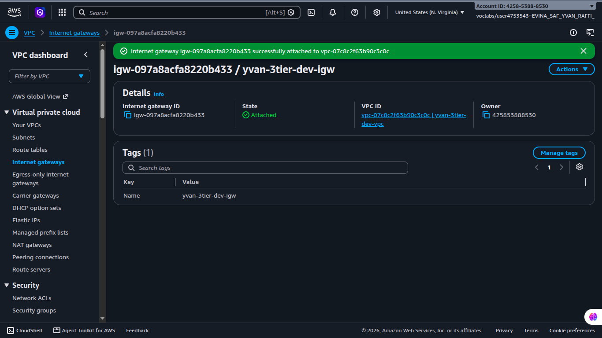

---

### Step 4 — Create the NAT Gateway

1. Go to **NAT gateways** then **Create NAT gateway**
2. Name: `yvan-3tier-dev-nat-gw`
3. Subnet: select `yvan-3tier-dev-public-subnet` (the NAT Gateway must go in the public subnet)
4. Connectivity type: Public
5. Click **Allocate Elastic IP** then **Create NAT gateway**

Wait until the status changes to Available (about 60 seconds).

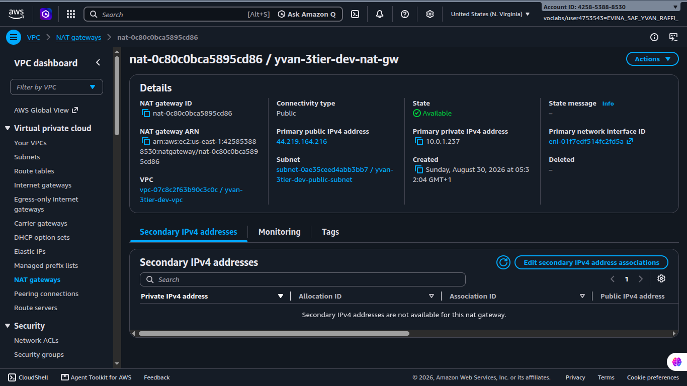

---

### Step 5 — Create the Route Tables

You need three route tables: one for the public subnet, one for the app subnet, and one for the database subnets.

**Public route table:**
1. Go to **Route tables** then **Create route table**
2. Name: `yvan-3tier-dev-public-rt`, VPC: your VPC
3. After creation, go to the **Routes** tab, click **Edit routes**, add:
   - Destination: `0.0.0.0/0`, Target: the Internet Gateway
4. Go to the **Subnet associations** tab, click **Edit subnet associations**, select the public subnet

**Private app route table:**
1. Create route table: `yvan-3tier-dev-private-app-rt`
2. Add route: `0.0.0.0/0` via the NAT Gateway
3. Associate with `yvan-3tier-dev-private-app-subnet`

**Database route table:**
1. Create route table: `yvan-3tier-dev-private-db-rt`
2. Do NOT add any routes (no internet access for the database tier)
3. Associate with both `yvan-3tier-dev-private-db-subnet-a` and `yvan-3tier-dev-private-db-subnet-b`


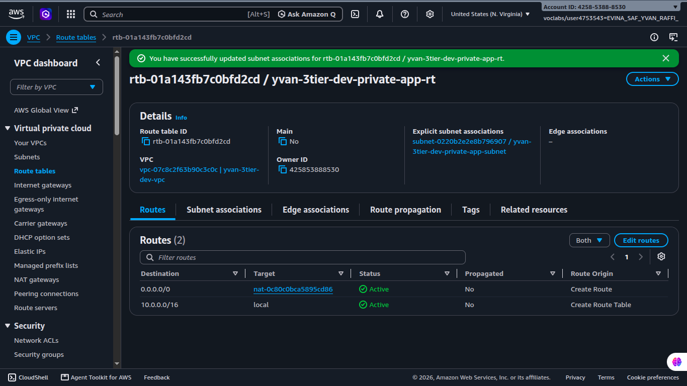

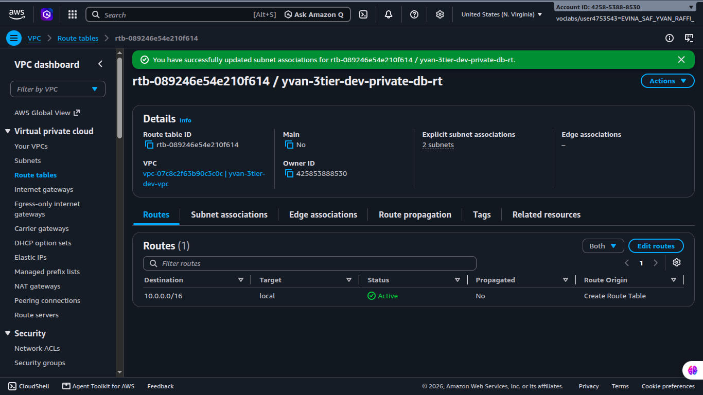

---

## Part 2: Security Groups

### Step 6 — Create the Four Security Groups

Go to **Security Groups** then **Create security group**. Create all four before adding any cross-referencing rules.

**Bastion SG** (`yvan-3tier-dev-sg-bastion`):
- No inbound rules
- Outbound: TCP 443 to 0.0.0.0/0

**Web Server SG** (`yvan-3tier-dev-sg-web`):
- Inbound: TCP 80 from 0.0.0.0/0 and TCP 443 from 0.0.0.0/0
- Outbound: TCP 443 to 0.0.0.0/0 and TCP 8080 to the App SG (add after creating App SG)

**App Server SG** (`yvan-3tier-dev-sg-app`):
- Inbound: TCP 8080 from the Web SG
- Outbound: TCP 3306 to the DB SG (add after creating DB SG) and TCP 443 to 0.0.0.0/0

**Database SG** (`yvan-3tier-dev-sg-db`):
- Inbound: TCP 3306 from the App SG
- No outbound rules (remove the default allow-all outbound rule)

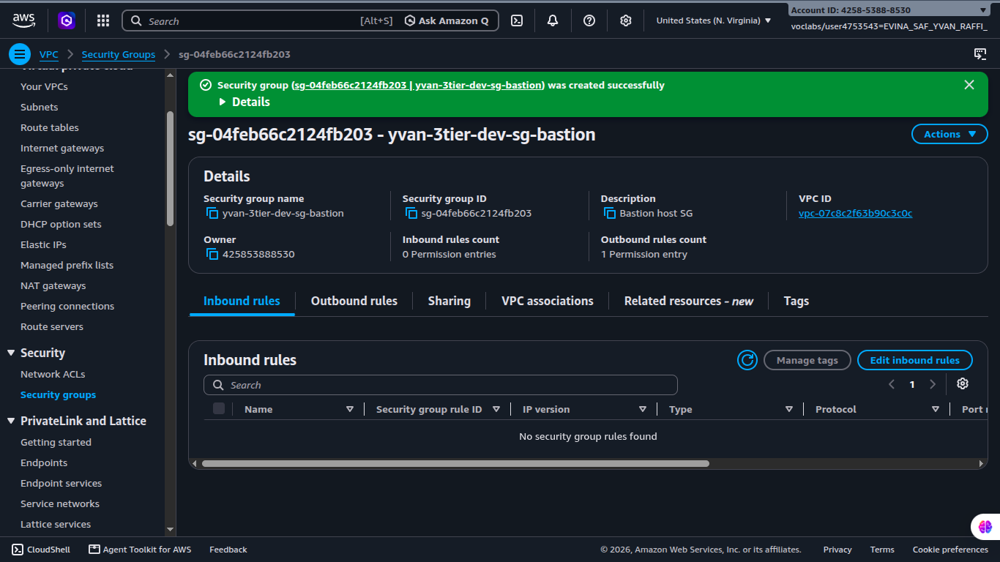

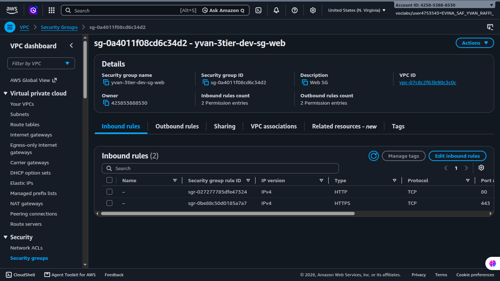

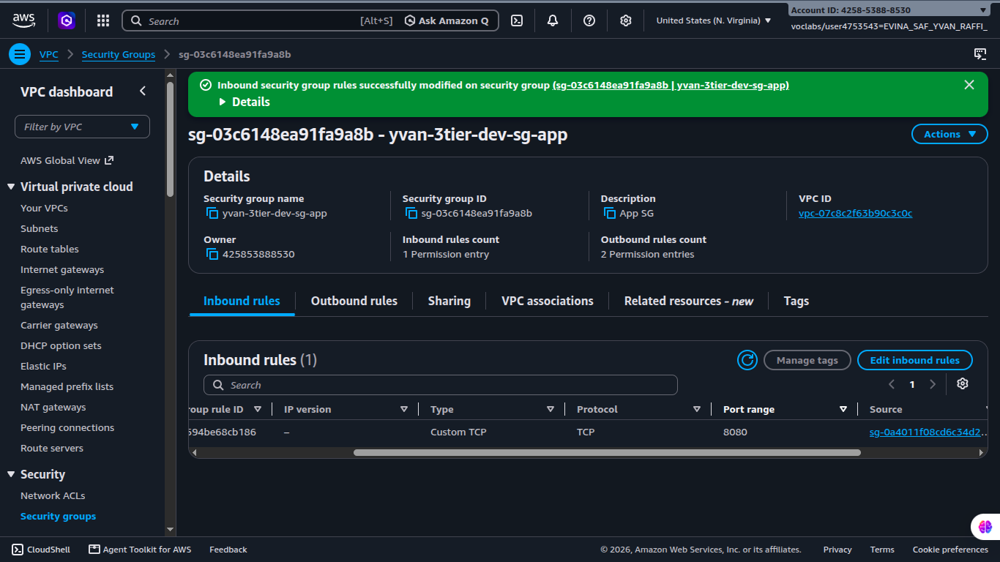

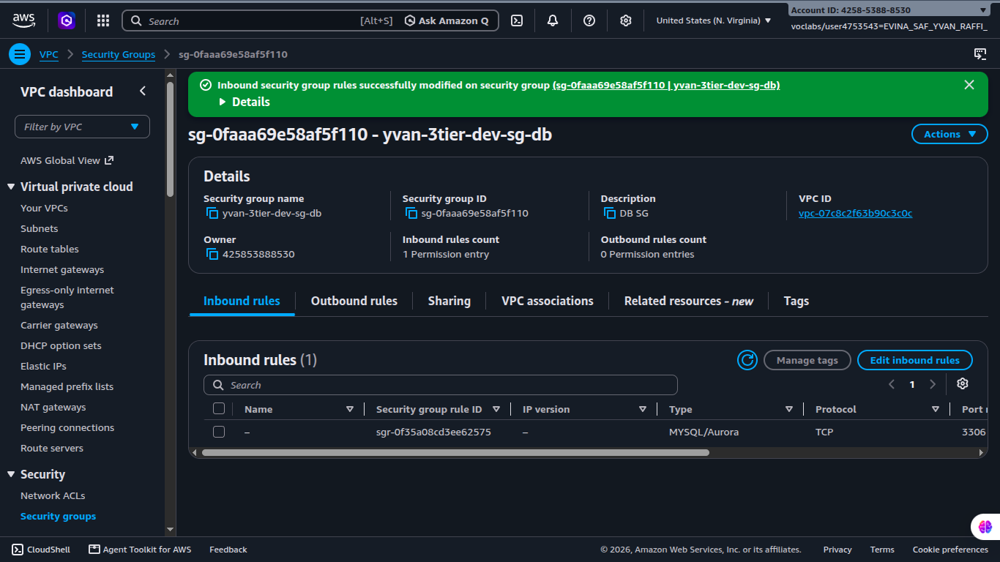

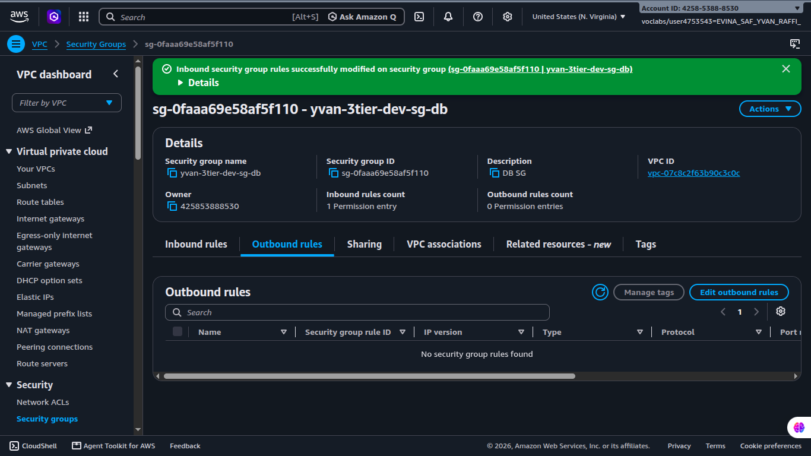

---

## Part 3: EC2 Instances

### Step 7 — Launch the Bastion Host

1. Go to **EC2** then **Launch instances**
2. Name: `yvan-3tier-dev-bastion`
3. AMI: Amazon Linux 2 (from Quick Start)
4. Instance type: t2.micro
5. Key pair: Proceed without a key pair (SSM does not need one)
6. Network: your VPC, public subnet, Auto-assign public IP: Enable
7. Security group: `yvan-3tier-dev-sg-bastion`
8. Expand **Advanced details**, set IAM instance profile to `LabInstanceProfile`
9. Still in Advanced details, set Metadata version to **V2 only (token required)**
10. Launch

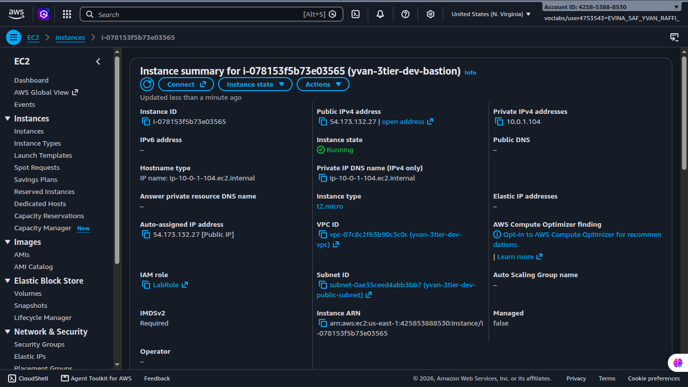

---

### Step 8 — Launch the Web Server

Same process as the Bastion Host with these differences:
- Name: `yvan-3tier-dev-web-server`
- Security group: `yvan-3tier-dev-sg-web`
- In User data, paste:

```bash
#!/bin/bash
yum update -y
amazon-linux-extras install -y lamp-mariadb10.2-php7.2 php7.2
yum install -y httpd
systemctl start httpd
systemctl enable httpd
echo "OK" > /var/www/html/health.html
```

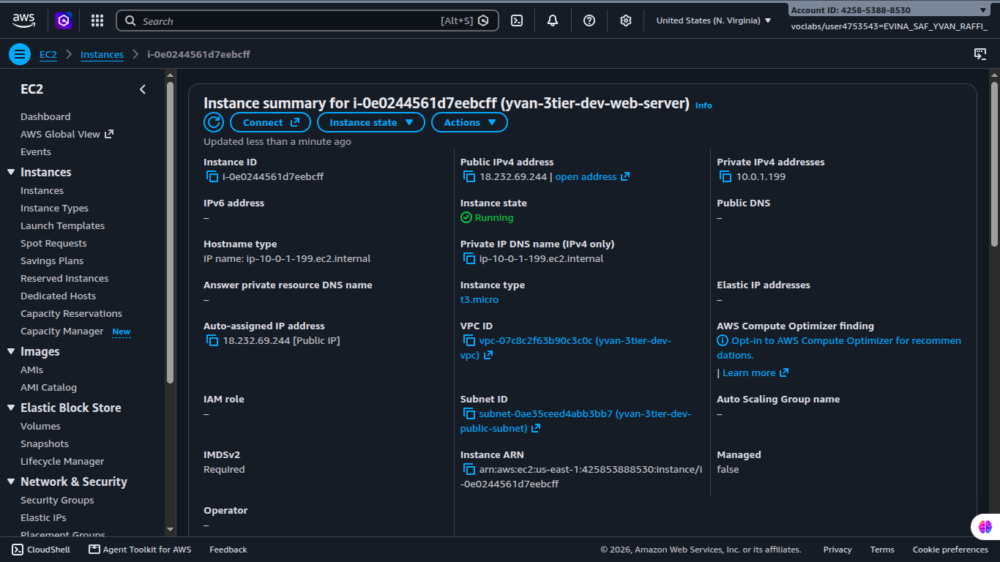

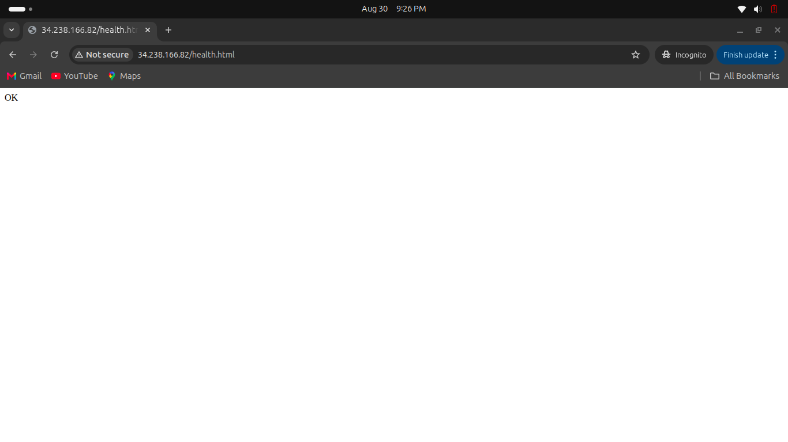

---

### Step 9 — Launch the App Server

Same process with these differences:
- Name: `yvan-3tier-dev-app-server`
- Subnet: `yvan-3tier-dev-private-app-subnet`, Auto-assign public IP: Disable
- Security group: `yvan-3tier-dev-sg-app`
- User data:

```bash
#!/bin/bash
yum update -y
yum install -y mariadb
```

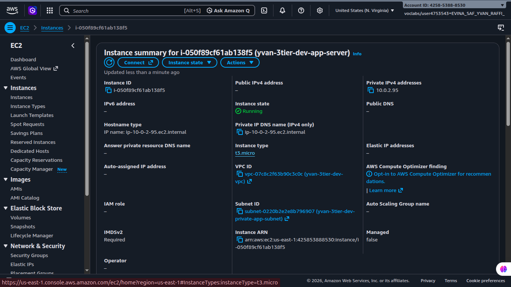

---

## Part 4: Database

### Step 10 — Create the DB Subnet Group

1. Go to **RDS** then **Subnet groups** then **Create DB subnet group**
2. Name: `yvan-3tier-dev-db-subnet-group`
3. VPC: your VPC
4. Add subnets: select both `private-db-subnet-a` (us-east-1a) and `private-db-subnet-b` (us-east-1b)
5. Create

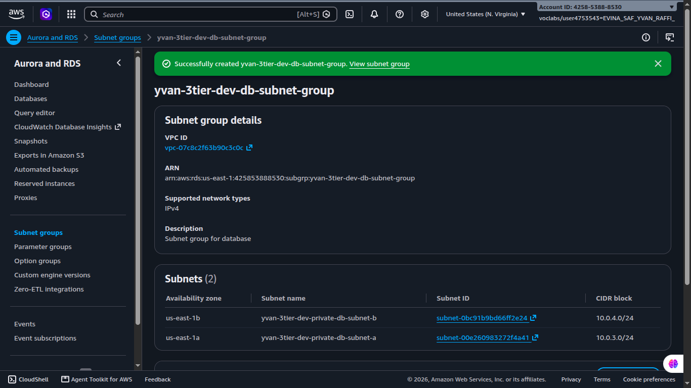

---

### Step 11 — Create the RDS Instance

1. Go to **RDS** then **Create database**
2. Creation method: Standard create
3. Engine: MariaDB, version 10.6
4. Template: Dev/Test
5. DB instance identifier: `yvan-3tier-dev-db`
6. Master username: `admin`
7. Master password: choose a strong password (at least 20 characters, mixed case, numbers, and special characters)
8. Instance class: db.t3.micro
9. Storage: 20 GB gp2, disable storage autoscaling
10. Availability: Do not create a standby instance
11. VPC: your VPC, Subnet group: `yvan-3tier-dev-db-subnet-group`
12. Public access: No
13. VPC security group: `yvan-3tier-dev-sg-db`
14. Additional configuration: Initial database name `mydb`, backup retention 7 days
15. Encryption: Enable (aws/rds key)
16. Create database

Wait until status is Available (5 to 10 minutes).

---

## Part 5: Testing

### Step 12 — Test the Web Server

From your local machine:

```bash
curl http://<web-server-public-ip>/health.html
```

Expected result: `OK`

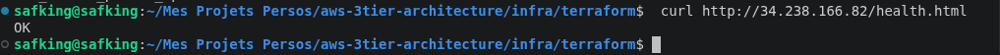

---

### Step 13 — Test SSM Access to the Bastion

Prerequisites: AWS CLI installed and configured, SSM Plugin installed.

```bash
aws ssm start-session --target <bastion-instance-id> --region us-east-1
```

Once connected, type `whoami` to confirm you are inside a session.

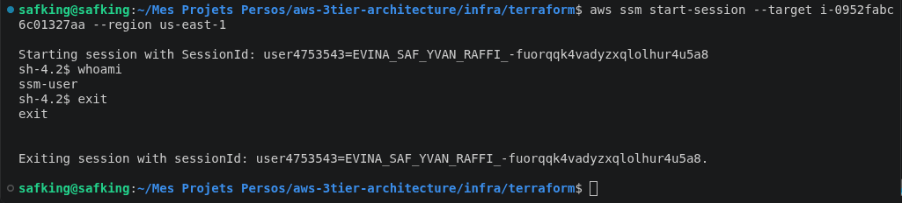

---

### Step 14 — Test App Server to Database Connection

Connect to the App Server via SSM:

```bash
aws ssm start-session --target <app-server-instance-id> --region us-east-1
```

Inside the session, connect to the database (use the RDS hostname only, without the port suffix):

```bash
mysql -h <rds-endpoint-hostname-only> -u admin -p mydb
```

Enter the password when prompted. Once connected:

```sql
SHOW DATABASES;
```

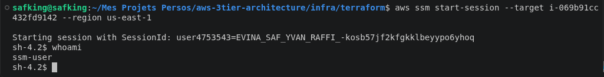

---

### Step 15 — Test Network Isolation (Negative Test)

From the Bastion SSM session, try to reach the database directly:

```bash
nc -zv <rds-endpoint-hostname> 3306
```

Expected result: connection timed out. This confirms that the Bastion cannot reach the database even though both are in the same VPC. The Security Group and NACL on the database subnet reject all traffic that does not come from the App Server.

---

### Step 16 — Test IMDSv2 Enforcement

From any SSM session:

```bash
# This should return nothing — IMDSv2 rejects plain GET requests without a token
curl -s -m 3 http://169.254.169.254/latest/meta-data/instance-id

# This should return the instance ID — correct IMDSv2 flow using a session token
TOKEN=$(curl -s -X PUT "http://169.254.169.254/latest/api/token" \
  -H "X-aws-ec2-metadata-token-ttl-seconds: 21600")
curl -s -H "X-aws-ec2-metadata-token: $TOKEN" \
  http://169.254.169.254/latest/meta-data/instance-id
```
